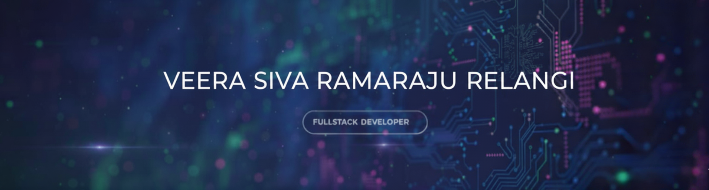

# Hi there! 👋 I'm VEERA SIVA RAMARAJU RELANGI.

**A Passionate Full Stack Developer** with a focus on modern web technologies, problem-solving, and creating scalable applications. I have a strong passion for exploring new ideas and solving challenging problems in competitive programming.

🔭 I’m currently working on 
• **SRKRCodingClub Official Website** – building a modern, interactive platform to engage and support coding enthusiasts. 

👯 Looking to collaborate on 
• Full Stack projects with **React, Node.js, Express, MongoDB**. 
• Open-source tools for productivity, education, or developer communities. 
• Hackathons or learning-driven initiatives.  

🌱 Currently learning 
• **TypeScript**, **Next.js**, and advanced patterns in React. 

💬 Ask me about 
• Building robust **MERN stack applications**. 
• Competitive programming, DSA, and algorithm optimization.

## 🌐 Socials:

>)  

# 💻 Tech Stack:

# 📊 GitHub Stats:

 
 

