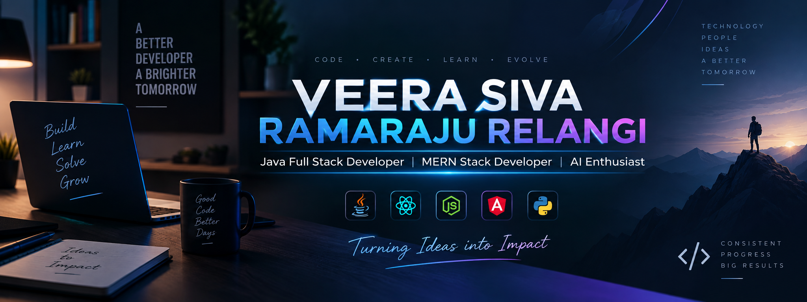

# Hi there! 👋 I'm VEERA SIVA RAMARAJU RELANGI.

**Java Full Stack Developer | MERN Stack Developer | AI Enthusiast** with a passion for building scalable web applications, solving challenging problems, and continuously exploring new technologies. I enjoy learning through development, problem-solving, and competitive programming.

🔭 I’m currently working on 
• Exploring and building applications while learning **AI & Generative AI** technologies. 

👯 Looking to collaborate on 
• Full Stack projects with **React, Node.js, Express, MongoDB**. 
• **Java Full Stack** projects using Java, Spring Boot, Angular, and MySQL. 
• Open-source tools for productivity, education, or developer communities. 
• Hackathons or learning-driven initiatives.  

🌱 Currently learning 
• **AI & Generative AI** concepts and technologies. 
• **Java Full Stack Development** with Spring Boot and Angular. 
• **Data Structures & Algorithms** and problem-solving patterns. 

💬 Ask me about 
• Building robust **MERN stack applications**. 
• **Java Full Stack Development** and web application development. 
• Competitive programming, **DSA**, and algorithm optimization. 
• Exploring **AI & Generative AI** applications. 

## 🌐 Socials:

# 💻 Tech Stack:

### Languages

### Frontend

### Backend

### Databases

### Tools

# 📊 GitHub Stats:

